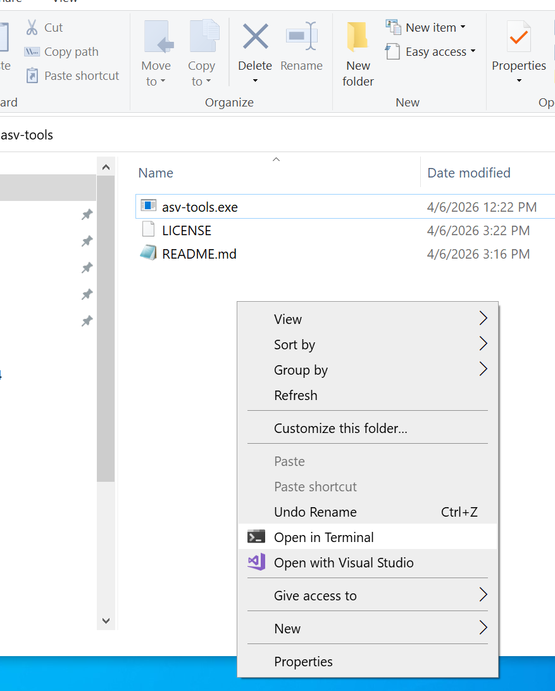

# **asv-tools**

## Astro-Video Tools

Copyright (C) 2026 Filip Szczerek (ga.software@yahoo.com)

version 0.1.0 (2026-04-06)

*This program comes with ABSOLUTELY NO WARRANTY. This is free software, licensed under GNU General Public License v3 and you are welcome to redistribute it under certain conditions. See the LICENSE file for details.*

## Overview

Astro-Video Tools operate on raw astronomical videos, facilitating:

- splitting into chunks
- frame quality analysis
- (*upcoming*) stretching histogram

## Command-line operation

For help on available commands, run:

```
asv-tools --help
```

To get help for a given command, run (e.g.):

```
asv-tools quality-analysis --help
```

## Examples

To split a SER file into 500-frame chunks, run:

```
asv-tools split-into-chunks --input-file "D:\Sun Videos\capture01.ser" --num-chunk-frames 500 --output-dir "D:\Sun Videos"
```

Note that if a path contains spaces, it needs to be surrounded by double quotes.

To perform quality analysis, run:

```
asv-tools quality-analysis --input-file "D:\Sun Videos\capture01.ser" --output-dir "D:\Sun Videos"
```

This creates the following output files:

- `capture01_best_<frame_num>.tif`: best-quality frame
- `capture01_worst_<frame_num>.tif`: worst-quality frame
- `capture01_best_frag.tif`: composite of best-quality frame fragments of the whole video
- `capture01_quality.csv`: frame quality in CSV format; chronological order
- `capture01_quality_sorted.csv`: frame quality in CSV format; sorted by quality

The CSV text files can be imported into (e.g.) a spreadsheet for plotting.


## Usage on MS Windows

Open the folder with `asv-tools.exe` in Windows Exporer. Right-click on empty space inside the folder and select "Open in Terminal" from the context menu:

[]

This will open a terminal window. The commands from [Examples](#examples) can be typed there and executed by pressing *Enter*.


## Building from source code

Navigate to the folder with source code; if needed, clone the repository first:

```Bash
git clone --recurse-submodules https://github.com/GreatAttractor/asv-tools.git
```

### Linux and alikes

Install the [Rust toolchain](https://www.rust-lang.org/learn/get-started). In the source folder, run:

```bash
cargo build --release
```

The executable will appear in `target/release` subdirectory. (Note that the first build will take some time, as dependencies must be downloaded and built first.)


### Building under MS Windows

Building under MS Windows has been tested in [MSYS2](https://www.msys2.org/) environment and the GNU variant of the [Rust toolchain](https://www.rust-lang.org/learn/get-started). (Alternatively, Visual Studio environment can be used.)

Download MSYS2 from http://www.msys2.org/ and follow its installation instructions. Then install the Rust toolchain: go to https://forge.rust-lang.org/infra/other-installation-methods.html and install the `x86_64-pc-windows-gnu` variant. The warnings about "Visual C++ prerequisites" being required and "Install the C++ build tools before proceeding" can be ignored. Note that you must customize "Current installation options" and change the "default host triple" to "x86_64-pc-windows-gnu".

Open the "MSYS2 MinGW 64-bit" shell (from the Start menu, or directly via `C:\msys64\msys2_shell.cmd -mingw64`), and install the build prerequisites:
```bash
pacman -S git base-devel mingw-w64-x86_64-toolchain
```

Pull Rust binaries into `$PATH`:

```bash
export PATH=$PATH:/c/Users/MY_USERNAME/.cargo/bin
```

then navigate to the source folder and build the program:

```bash
cargo build --release
```

The executable will appear in `target/release` subdirectory. (Note that the first build will take some time, as dependencies must be downloaded and built first.)
